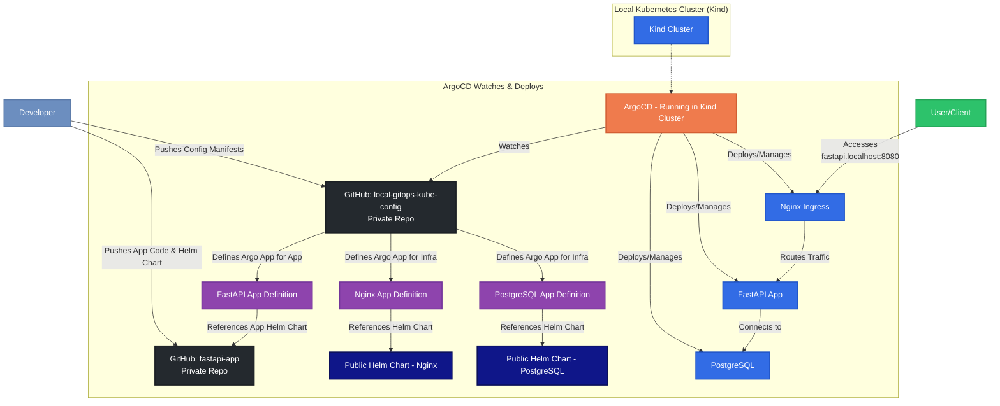

# Local GitOps CI/CD with Kind, ArgoCD, and Helm

Develop and experience a local GitOps workflow for Kubernetes applications using Docker, Kind, Kubernetes, ArgoCD, Helm, and GitHub.

## Purpose

This project demonstrates how to establish a GitOps-driven development environment on your local workstation. By leveraging tools like Kind for local Kubernetes clusters, Helm for packaging applications, and ArgoCD for continuous delivery from Git, you can simulate and learn production-grade CI/CD practices. This setup allows for declarative configuration management, automated deployments, and a clear audit trail of all changes made to your applications and infrastructure, all managed through Git repositories.

## Architecture

The following diagram illustrates the GitOps workflow established in this project:



## Tools & Explanation
This project utilizes the following tools to achieve a local GitOps workflow:

### Docker:

* **_Explanation:_** A platform for developing, shipping, and running applications in containers.
* **_Role:_** Used to containerize the FastAPI application. Docker Desktop also provides the underlying container runtime for Kind on macOS and Windows.

### Kind (Kubernetes in Docker):

* **_Explanation:_** A tool for running local Kubernetes clusters using Docker container "nodes."
* **_Role:_** Provides the local Kubernetes environment where all applications (ArgoCD, Nginx, PostgreSQL, FastAPI app) are deployed and managed. It allows for quick creation and deletion of multi-node Kubernetes clusters for development and testing.

### Kubernetes (K8s):

* **_Explanation:_** An open-source system for automating deployment, scaling, and management of containerized applications.
* **_Role:_** The orchestration platform that runs our applications. Kind creates a conformant Kubernetes cluster.

### Helm:

* **_Explanation:_** The package manager for Kubernetes. Helm Charts help you define, install, and upgrade even the most complex Kubernetes applications. [https://dev.to/kitarp29/hatching-a-helm-chart-l52]
* **_Role:_** Used to package the FastAPI application and to deploy infrastructure components like Nginx Ingress and PostgreSQL. ArgoCD leverages Helm charts for deploying these applications.

### ArgoCD:

* **_Explanation:_** A declarative, GitOps continuous delivery tool for Kubernetes.
* **_Role:_** The core of our GitOps workflow. ArgoCD monitors the local-gitops-kube-config repository for changes to application definitions (which point to Helm charts or other Kubernetes manifests). When changes are detected, ArgoCD automatically syncs the desired state from Git to the Kind cluster, ensuring the cluster's state matches the configuration in Git.

### Git:

* **_Explanation:_** A distributed version control system.
* **_Role:_** Used to manage the source code for the FastAPI application (fastapi-app repository) and the Kubernetes/ArgoCD configurations (local-gitops-kube-config repository). Git serves as the single source of truth for our applications and their desired state.

### GitHub:

* **_Explanation:_** A platform for hosting Git repositories.
* **_Role:_** Hosts the private Git repositories (fastapi-app and local-gitops-kube-config) that ArgoCD monitors. Changes pushed to these repositories trigger the GitOps workflow.

## Setting Up the Local Kubernetes Cluster using Kind
A specific Kind configuration is recommended to expose ports for Ingress.

1. **`local-cluster-deployment.yaml`:**
Find this file in the root of this local-gitops-kube-config repository:
```yaml
# local-cluster-deployment.yaml
kind: Cluster
apiVersion: kind.x-k8s.io/v1alpha4
name: local-gitops-cluster # Define the cluster name here
nodes:
- role: control-plane
  kubeadmConfigPatches:
  - |
    kind: InitConfiguration
    nodeRegistration:
      kubeletExtraArgs:
        node-labels: "ingress-ready=true"
  extraPortMappings:
  - containerPort: 80
    hostPort: 8080 # Host port for HTTP ingress, access at http://localhost:8080
    protocol: TCP
  - containerPort: 443
    hostPort: 8443 # Host port for HTTPS ingress, access at https://localhost:8443
    protocol: TCP
- role: worker
- role: worker
```

2. **Create the Cluster:**
Navigate to the directory containing `local-cluster-deployment.yaml` and run:
```bash
kind create cluster --config=local-cluster-deployment.yaml
```
If you didn't include name in the YAML, or want to override it:
```bash
kind create cluster --config=local-cluster-deployment.yaml --name local-gitops-cluster
```
Verify the cluster:
```bash
kubectl cluster-info --context kind-local-gitops-cluster
```

3. **Install ArgoCD** manually and port-forward for local access:
```bash
kubectl create namespace argocd
kubectl apply -n argocd -f https://raw.githubusercontent.com/argoproj/argo-cd/stable/manifests/install.yaml
kubectl rollout status deployment/argocd-server -n argocd
kubectl port-forward svc/argocd-server -n argocd 8080:443
```

## Repository Structure
This repository is structured to manage the deployment of various applications into the Kubernetes cluster via ArgoCD:

```
.
├── argocd/                # (Optional) For ArgoCD self-management application definition
│   └── application.yaml
├── infra/                 # Infrastructure components
│   ├── nginx-ingress/
│   │   └── application.yaml # ArgoCD Application manifest for Nginx Ingress
│   └── postgresql/
│       └── application.yaml # ArgoCD Application manifest for PostgreSQL
└── apps/                  # Custom applications
    └── fastapi-app/
        └── application.yaml # ArgoCD Application manifest for the FastAPI application
```

Each application.yaml file is an ArgoCD Application Custom Resource Definition (CRD) that tells ArgoCD:

* Which Git repository to monitor (source).
* Which path within that repository contains the Kubernetes manifests or Helm chart.
* The target revision (e.g., branch, tag, commit).
* The destination Kubernetes cluster and namespace.
* Any specific parameters or values overrides for Helm charts.

## Getting Started
1. **Prerequisites:** Ensure Docker, Kind, kubectl, Helm, and the ArgoCD CLI are installed.
Clone this repository: `git clone https://github.com/BenedictusAryo/local-gitops-kube-config.git`
2. **Set up Kind Cluster:** Follow the instructions from the main guide to create your Kind cluster with appropriate port mappings.
3. **Install ArgoCD:** Install ArgoCD into your Kind cluster and configure access (login, connect to Git repos).
4. **Apply ArgoCD Applications:** Once ArgoCD is running and can access this repository, it will automatically start deploying the applications defined herein. You can also manually trigger syncs via the ArgoCD UI or CLI.
    * Initially, you might apply a root application or apply these manifests directly using `kubectl apply -n argocd -f <path-to-application.yaml>`. For a fully GitOps approach, ensure ArgoCD is configured to watch this repository.
*(You can add more specific instructions on how to bootstrap the process if you have a root ArgoCD Application manifest that deploys all other applications, or if users need to manually apply these manifests to ArgoCD first.)*

## CI/CD Workflow

1. Application Code Change (fastapi-app repo):

* Developer modifies application code.
* Builds and pushes a new Docker image (e.g., to a local Kind registry or a remote registry).
* Updates the Helm chart in the fastapi-app repo (e.g., image tag, application config).
* Pushes changes to the fastapi-app Git repository.

2. Configuration Change (local-gitops-kube-config repo):
* Developer modifies Helm chart values, replica counts, or adds/removes applications by changing the ArgoCD Application manifests in this repository.
* Pushes changes to the local-gitops-kube-config Git repository.

3. ArgoCD Sync:

* ArgoCD detects changes in the watched Git repositories/paths/branches.
* ArgoCD compares the live state in the Kubernetes cluster with the desired state in Git.
* ArgoCD automatically (if configured) syncs the changes, applying them to the Kind cluster.

This ensures your local Kubernetes environment accurately reflects the configurations defined in your Git repositories.